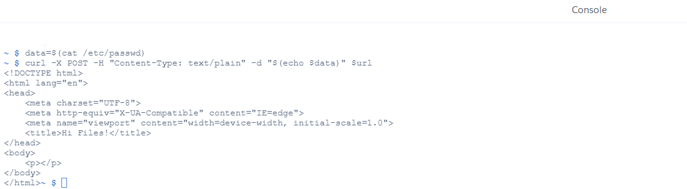
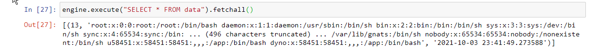

# savepostdata

## Saves any data sent via post request to a database!
  

### Need to export data?  Use curl to send data to a private webserver that will store it in a database

### Later, query the database for the data!

